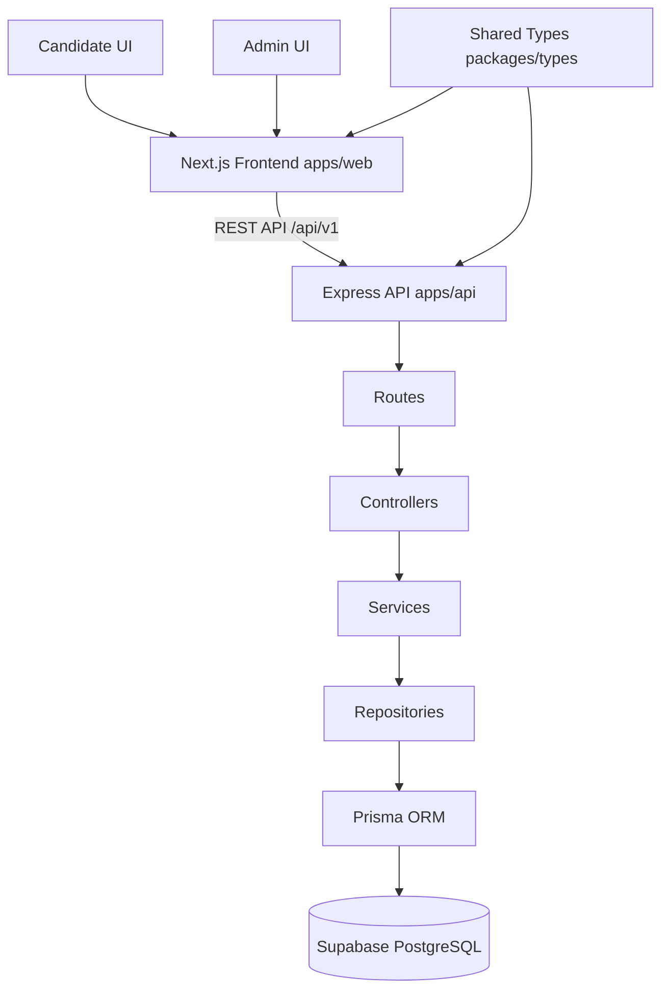

# Unizoy Assignment - Job Board

This is a full stack Job Board for the Unizoy internship assignment.

The app has 2 sides:
- Candidate side: view jobs and apply.
- Admin side: login, post jobs, review applications, update application status.

## Submission Deliverables
- GitHub repository
- Deployed frontend link
- Deployed backend link

## Live Links
- Frontend: https://unizoy.vercel.app/
- Backend API: https://unizoy-assignment.onrender.com

## Tech Stack (Simple View)
- Frontend: Next.js 14, TypeScript, Tailwind CSS, Framer Motion
- Backend: Node.js, Express, TypeScript
- Database: PostgreSQL (Supabase)
- ORM: Prisma
- Auth: JWT in HTTP-only cookies
- Validation: Zod
- State: Zustand + TanStack Query

## How The App Works
1. Admin logs in.
2. Admin creates jobs.
3. Candidate browses jobs and applies.
4. Admin reviews applications and changes status.

## Architecture Diagram


## Folder Structure
```text
unizoy-job-board/
  apps/
    api/      backend code
    web/      frontend code
  packages/
    types/    shared TypeScript types
  .env.example
  README.md
```

## Setup For Beginners (Step By Step)

### Step 1: Install tools
- Install Node.js 20+
- Install Git
- Have a Supabase project ready

### Step 2: Clone project
```bash
git clone https://github.com/Ketanop321/Unizoy-assignment.git
cd Unizoy-assignment
npm install
```

### Step 3: Configure environment files
Create and update `apps/api/.env` by copying from `.env.example` and filling real values.

Notes:
- `DATABASE_URL` should use pooled Supabase connection (usually port 6543).
- `DIRECT_URL` should use direct database host for migrations.

### Step 4: Run migration and seed
```bash
npm run prisma:generate -w apps/api
npm run prisma:migrate -w apps/api -- --name init_schema
npm run prisma:seed -w apps/api
```

Note: seed only ensures the admin account and does not insert sample jobs or applications.

### Step 5: Start backend
```bash
npm run dev -w apps/api
```
Backend URL: http://localhost:5000

### Step 6: Start frontend (new terminal)
```bash
npm run dev -w apps/web
```
Frontend URL: http://localhost:3000

## Default Admin Login
- Email: admin@unizoy.com
- Password: Admin@123

## Main Features Checklist

### Candidate
- View all active jobs
- Filter by job type
- Search jobs
- Open job details
- Apply with name, email, resume link, cover note
- Duplicate apply to same job is blocked

### Admin
- Login and logout
- View dashboard stats
- Create, edit, deactivate jobs
- View all applications
- Update application status: PENDING, REVIEWED, SHORTLISTED, REJECTED

## API Quick Reference

### Auth
- POST /api/v1/auth/login
- POST /api/v1/auth/logout
- GET /api/v1/auth/me
- POST /api/v1/auth/refresh
- GET /api/v1/auth/csrf-token

### Jobs
- GET /api/v1/jobs
- GET /api/v1/jobs/:id
- POST /api/v1/jobs
- PATCH /api/v1/jobs/:id
- DELETE /api/v1/jobs/:id
- GET /api/v1/admin/jobs
- GET /api/v1/admin/jobs/:id

### Applications
- POST /api/v1/jobs/:id/apply
- GET /api/v1/admin/applications
- GET /api/v1/admin/applications/:id
- PATCH /api/v1/admin/applications/:id/status

## Useful Commands
```bash
# full type check
npm run typecheck

# lint
npm run lint

# backend tests
npm run test -w apps/api

# production build
npm run build
```

## Deployment Guide (Simple)

### 1) Database: Supabase
- Supabase is used for PostgreSQL database hosting.
- Copy pooled and direct Postgres URLs.
- Put them in backend env.

### 2) Backend: Railway or Render
- Express backend is not deployed on Supabase in this setup.
- Connect GitHub repo
- Root directory: apps/api
- Add env vars from apps/api/.env
- Deploy

### 3) Frontend: Vercel
- Connect GitHub repo
- Root directory: apps/web
- Add NEXT_PUBLIC_API_URL pointing to deployed backend
- Deploy

### 4) Update Live Links section in this README

## Troubleshooting (Beginner Friendly)

### Problem: Migration fails
Try:
1. Check DATABASE_URL and DIRECT_URL are correct.
2. Ensure password is correct.
3. Ensure sslmode=require is present for Supabase URLs.

### Problem: Admin login fails
Try:
1. Run seed again.
2. Confirm admin email is admin@unizoy.com.
3. Confirm SEED_ADMIN_PASSWORD matches what you seeded.

### Problem: Frontend cannot call backend
Try:
1. Check backend is running on port 5000.
2. Check CORS_ORIGIN in backend env.
3. Check frontend API URL points to backend.

## Security Notes
- Do not commit real secrets.
- Keep apps/api/.env local only.
- Rotate secrets if exposed.

## Author
- Ketan
